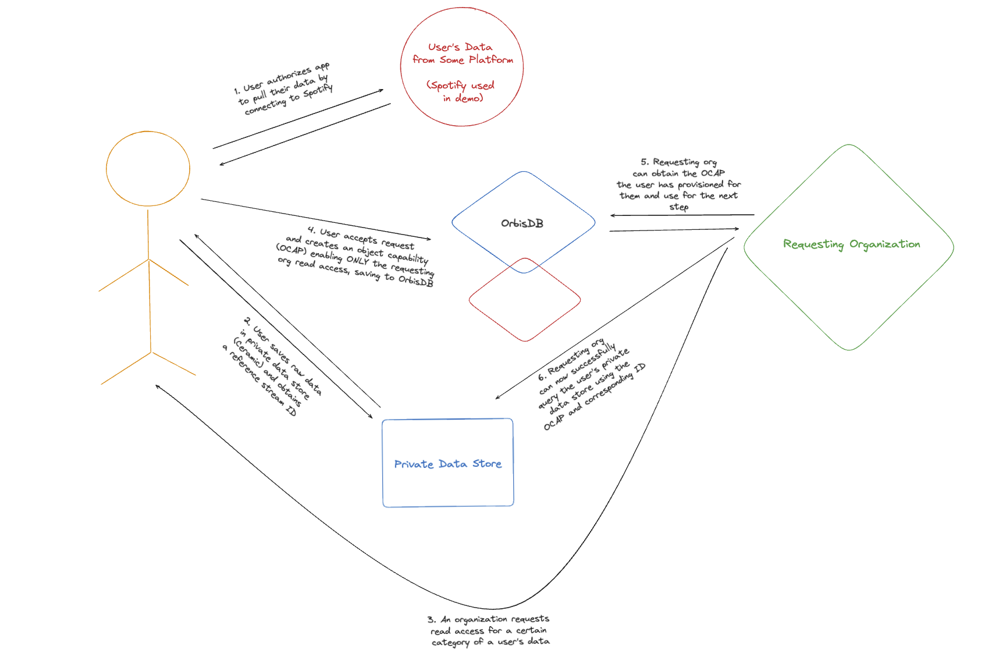

# Private Data Playground with Indexing

This demo application uses a minimal webapp to demonstrate how Ceramic can facilitate the sharing of private data between two users. In this iteration, the demo only implements access control on the Ceramic-One data feed API, showing how data can only be read if the controlling user grants the user who desires access a capability. Both users share the same node, but can only access each others data if explicitly granted that capability.

As an add-on, this version also shows how those capabilities can be saved to Ceramic via OrbisDB, and programmatically queried if a matching authorized account has relevant capabilities they can access from other accounts.

## Flow

<p align="center" width="100%">
    
</p>

## Getting Started

1. First, create a copy of the [example env file](.env.example) and rename it `.env` in the root of this directory.

2. Next, create a WalletConnect project ID by visiting the [WalletConnect Sign In](https://cloud.walletconnect.com/sign-in) page, create a new project (with a name of your choosing and the `App` type selected), and copy the `Project ID` key once available. 

In your new environment file, assign this value to `NEXT_PUBLIC_PROJECT_ID`.

3. Clone the [rust-ceramic](https://github.com/ceramicnetwork/rust-ceramic) repository and check out into the [feat/private-data](https://github.com/ceramicnetwork/rust-ceramic/tree/feat/private-data) branch. Next, install Profobuf, run the build process, and initialize your node:

```bash
# Install protobuf (can alternatively use `brew install protobuf`)
PROTOC_VERSION=3.20.1
PROTOC_ZIP=protoc-$PROTOC_VERSION-linux-x86_64.zip
curl --retry 3 --retry-max-time 90 -OL https://github.com/protocolbuffers/protobuf/releases/download/v$PROTOC_VERSION/$PROTOC_ZIP \
    && unzip -o $PROTOC_ZIP -d /usr/local bin/protoc \
    && unzip -o $PROTOC_ZIP -d /usr/local 'include/*' \
    && rm -f $PROTOC_ZIP

# Check out into the relevant branch
git checkout feat/private-data

# Build and initialize node
cargo run -p ceramic-one -- daemon
```

4. Set up your Orbis dependencies by logging into the [Orbis Studio](https://studio.useorbis.com/).

Once logged in, assign your "Environment ID" to `NEXT_PUBLIC_ENV_ID` in your `.env` file.

Next, create a new context and assign the corresponding StreamID (long string of letters) to `NEXT_PUBLIC_CONTEXT_ID` in your `.env` file.

Finally, go into the "Model builder" tab at the top of the studio view and define a new table using [this definition](tables/tables.sql). Take the corresponding ID and assign it to `NEXT_PUBLIC_TABLE_ID` in your `.env` file.

5. This demo uses Spotify for OAuth (through NextAuth). Set up a new free app in your [Spotify Developer Dashboard](https://developer.spotify.com/dashboard) and assign your client ID and client secret to `SPOTIFY_CLIENT_ID` AND `SPOTIFY_CLIENT_SECRET` in your `.env` file, respectively.

6. Create and assign a value for your `NEXTAUTH_SECRET` by running the following in your terminal:

```bash
openssl rand -base64 32
```

7. Back in the root of this repository, install your dependencies:

Install your dependencies:

```bash
npm install
```

8. Finally, start up your UI:

```bash
npm run dev
```

9. Navigate to `http://localhost:3000` in your browser to view the UI

## Interacting with the Demo

In your browser you'll see a simple application layout with the option to "Connect Wallet" in the navigation. Follow along with the steps below to interact with the app:

### Creating Capability Object

1. Click the "Connect Wallet" button to connect your wallet. Keep track of which account you use for this portion - we will be using different accounts to read this data. Please ensure you are authenticating with Eth Mainnet for all sign-ins throughout this demo.

2. You will see a signature request with the message "Give this application access to some of your data on Ceramic" - signing this request will create an authenticated browser session that the application will reference when writing data on your behalf. Go ahead and approve this request by clicking "Sign In".

3. Click on the "Write" toggle above the "C1 Endpoint" box. You will be prompted to enter a message - this can be any arbitrary message you'd like to use. Go ahead and enter this here and click "Create".

4. Grab another Eth address that you own and enter it into the text area underneath "Delegate read access to". Make a note of which address you entered

5. Finally, click "Create Capability" to generate the capability object which delegates read access to the Eth address you own. Click "Save Capability" at the end, which will write to Ceramic via OrbisDB

### Reading Data Successfully

1. Manually disconnect the account you used for the previous session and sign in using the address you entered for step 5 from the previous section (or open the app in a new incognito tab). 

2. Click the "Read" toggle above the "C1 Endpoint" box.

3. If you signed into the correct address, you should see the StreamID of the capability you created using the other account. Click "Load"

4. You should now be able to view the original message you entered and saved from the previous section.


